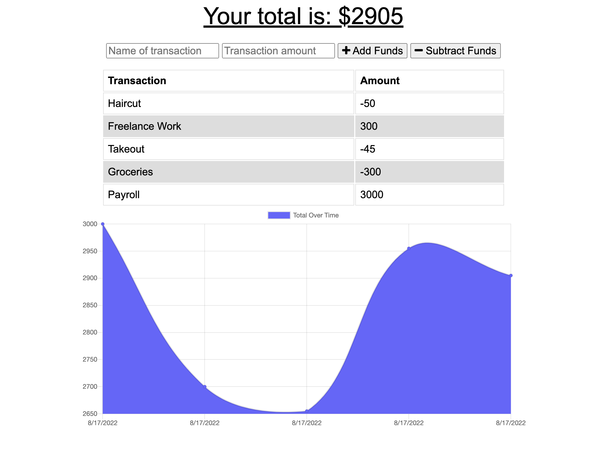

# Budget Tracker

## Table of Contents

- [User Story](#user-story)
- [Description](#description)
- [Usage](#usage)
- [Requirements](#requirements)
- [Application](#application)
- [Questions](#questions)

## User Story

- AS AN avid traveler
- I WANT to be able to track my withdrawals and deposits with or without a data/internet connection
- SO THAT my account balance is accurate when I am traveling

## Description

This application allows users to track their budget by adding expenses and deposits to their monthly budget. Budget Tracker is an update to an existing application to allow for offline access and functionality using IndexedDB and Service Workers to create a PWA.

## Usage

Simply go to the [Budget Tracker Website](https://safe-fjord-55271.herokuapp.com/) and enter the name of your transaction, the amount of your transaction, whether you are subtracting funds or adding funds. Offline functionality exists for the app so users can adjust their budget with minimal internet single. In addition, Budget Tracker is a PWA that can be downloaded to your phone or computer from the website.

## Requirements

- GIVEN a budget tracker without an internet connection
- WHEN the user inputs an expense or deposit
- THEN they will receive a notification that they have added an expense or deposit
- WHEN the user reestablishes an internet connection
- THEN the deposits or expenses added while they were offline are added to their transaction history and their totals are updated

## Application

[Link to deployed Application](https://safe-fjord-55271.herokuapp.com/)

## Questions?

For any questions, please email gilinamcbride@gmail.com, or visit any other projects on [Github](github.com/gilinamcbride).
